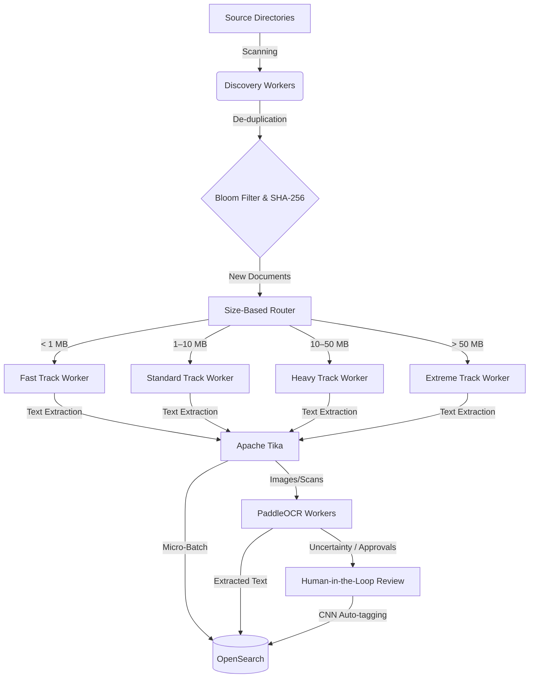

# 🚀 RADAR — Enterprise Document Search & OCR Platform

<div align="center">
  <p><strong>R</strong>apid <strong>A</strong>rchival <strong>D</strong>ocument <strong>A</strong>nalysis & <strong>R</strong>etrieval</p>
  <p><em>A production-grade document ingestion, OCR extraction, and full-text search platform built for enterprise environments.</em></p>
</div>

## 📖 Table of Contents
- [About The Project](#about-the-project)
- [System Architecture](#system-architecture)
- [Key Features](#key-features)
- [Performance Benchmarks](#performance-benchmarks)
- [Project Structure](#project-structure)
- [Getting Started](#getting-started)
- [Usage](#usage)
- [Configuration](#configuration)
- [Monitoring & Operations](#monitoring--operations)
- [License](#license)

---

## 🎯 About The Project

**RADAR** solves the challenge of processing, indexing, and searching massive enterprise document repositories. It seamlessly routes files, extracts text (even from scanned documents and images via OCR), and makes them instantly searchable through OpenSearch.

Whether you're dealing with millions of PDFs, scanned contracts, or scattered images, RADAR provides a reliable, scalable, and crash-resilient pipeline to make your data easily accessible.

---

## 🏗️ System Architecture

RADAR uses a highly parallel, multi-track processing pipeline.



### Flow Breakdown:
1. **Discovery**: Scans defined source directories for new or modified files.
2. **Deduplication**: Fast Bloom filters combined with SHA-256 hashing ensure files are only processed once.
3. **Routing**: Documents are routed to specialized worker tracks based on file size to prevent head-of-line blocking.
4. **Extraction**: Apache Tika extracts text and metadata.
5. **OCR Pipeline**: Scanned PDFs and images are routed to GPU/CPU-accelerated PaddleOCR workers in the background.
6. **Indexing**: Data is micro-batched and streamed into OpenSearch for sub-second retrieval.

---

## ✨ Key Features

- 🏎️ **Multi-Track Extraction**: Intelligent routing by file size prevents massive files from blocking smaller ones.
- 👁️ **Advanced OCR Capabilities**: Powered by PaddleOCR for state-of-the-art text extraction from images and scanned documents.
- 🔍 **Real-Time Search**: Leveraging OpenSearch for multi-field ranking, OCR-aware fuzzy matching, and deep text search.
- 🧑‍💻 **Human-in-the-Loop (HITL)**: A visual snippet review portal allows human verification of signatures, stamps, and logos.
- 🧠 **CNN Visual Memory**: Approved visual elements are memorized and auto-tagged in future document scans.
- 🛡️ **Zero-False-Positive Dedup**: Bloom filters provide rapid, low-memory file deduplication.
- 🏷️ **Intelligent Tagging**: NLP processing via spaCy maps documents to taxonomies and external metadata.
- 📊 **Live Dashboard**: A Streamlit-based UI for real-time pipeline monitoring and search.
- 🔄 **Crash Resilience**: Built-in checkpointing, Redis persistence, and graceful shutdown/resume capabilities.

---

## ⚡ Performance Benchmarks

RADAR is built for speed and reliability at scale:

| Metric | Performance |
| :--- | :--- |
| **Extraction Throughput** | 245–420 files/sec |
| **Indexing Throughput** | 12,000–20,000 docs/sec |
| **Time-to-Searchable** | 10–30 seconds |
| **OCR Pages/Hour** | 5,000+ |

---

## 📂 Project Structure

```text
RADAR/
├── bin/                        # Service startup/shutdown scripts
├── config/                     # Pipeline & OpenSearch configurations
├── src/                        # Core Python application
│   ├── main.py                 # CLI entry point
│   ├── orchestrator/           # Master orchestrator & worker coordination
│   ├── discovery/              # File system scanner & Bloom filter
│   ├── extraction/             # Tika-based text extraction workers
│   ├── indexing/               # OpenSearch bulk indexing
│   ├── ocr/                    # PaddleOCR pipeline & visual memory CNN
│   ├── tagging/                # NLP metadata tagging (spaCy + taxonomy)
│   ├── ui/                     # Streamlit dashboard & PDF reports
│   ├── api/                    # FastAPI search REST endpoints
│   ├── tools/                  # Diagnostic & maintenance utilities
│   └── utils/                  # Shared helper functions
├── models/                     # ML model weights (not in git)
├── runtime/                    # Generated at runtime (not in git)
├── requirements.txt            # Python dependencies
└── start_everything.bat        # One-click startup (Windows)
```

---

## 🚀 Getting Started

### Prerequisites
- **Python 3.10+**
- **Redis 3.2+**
- **OpenSearch 2.12+**
- **Apache Tika 2.9+**
- **Poppler** (for PDF-to-image OCR conversion)

### Installation

1. **Clone the repository and set up the environment**:
   ```bash
   python -m venv .venv
   .venv\Scripts\activate
   pip install -r requirements.txt
   ```

2. **Start foundational services**:
   ```powershell
   # Option A: All-in-one startup
   .\start_everything.bat

   # Option B: Individual services
   .\bin\start_opensearch.bat
   .\bin\start-tika.ps1
   # Redis starts automatically if installed as a Windows service
   ```

---

## 💻 Usage

### Pipeline CLI (`src/main.py`)

RADAR provides a robust CLI to manage the ingestion pipeline:

```bash
# Start full pipeline
python src/main.py start

# Resume from previous checkpoint
python src/main.py start --mode resume

# Graceful shutdown
python src/main.py stop

# View system status and queue metrics
python src/main.py status
python src/main.py stats

# System reset (clear DBs, queues, and indexes)
python src/main.py reset
python src/main.py reset --force

# Recover stuck items
python src/main.py reset_stale
```

### Dashboard Access

Launch the Streamlit monitoring and search dashboard:

```powershell
.\bin\start-dashboard.ps1
```
Navigate to: **[http://localhost:8501](http://localhost:8501)**

#### Dashboard Features:
- **Search Tab**: Full-text search, filtering, keyword highlighting, and PDF report generation.
- **Live Audit**: Real-time event feed and state matrix exports.
- **Snippet Review**: HITL visual verification portal with CNN auto-tagging.
- **System Monitor**: Visual pipeline metrics, ETAs, and failure analysis.

---

## ⚙️ Configuration

The entire system is highly customizable via `config/config.yaml`. Key sections include:

- `paths`: Define source directories, working roots, and log locations.
- `discovery`: File inclusion/exclusion patterns and scanning thread limits.
- `extraction`: Worker pools sizing, Tika connection details, and file size category thresholds.
- `indexing`: OpenSearch credentials, bulk batch sizes, and index mappings.
- `ocr`: PaddleOCR GPU/CPU toggles, visual review confidence thresholds.
- `tagging`: spaCy model selection and taxonomy configurations.
- `orchestrator`: Circuit breakers, health check intervals, and resource limits.

---

## 📊 Monitoring & Operations

- **Runtime Logs**: Detailed rotating logs per component in `runtime/logs/`.
- **Search UI**: Streamlit interface at `http://localhost:8501`.
- **REST API**: FastAPI Swagger UI available at `http://localhost:8080/docs`.
- **OpenSearch**: Database accessible at `http://localhost:9200`.

---

## 📄 License

Proprietary. Internal use only.
